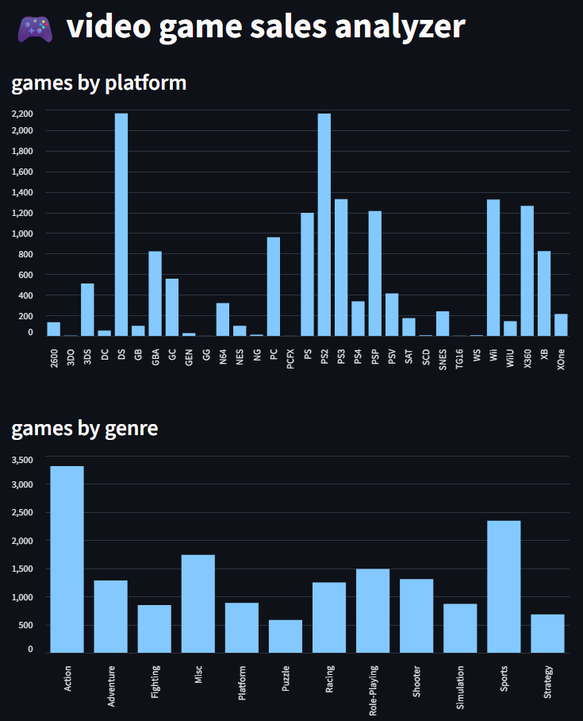

# video game sales analysis

#### video demo: https://youtu.be/zpc6q1SNRVU

#### to acess the app: https://salesgamesanalysis.streamlit.app/

#### description:

this project is called **video game sales analysis**. it’s a simple but fully functional data analysis app created for my cs50p final project. the main goal of this app is to provide some insights into the video game industry using real sales data.

i’m using a real dataset named **vgsales.csv**, which contains thousands of video games released across different platforms, genres, publishers and years. it includes data on global sales and other useful details. using this dataset allows me to practice data analysis while also providing useful visualizations for anyone interested in the video game market.

the app allows me to:

- calculate how many games were released on each gaming platform
- show how many games exist in each genre
- visualize the top publishers with the most games published
- provide simple bar charts for better visual understanding

i’m using the python library **pandas** to read and process the csv data. pandas is perfect for handling tabular data and allows me to easily group, count, and summarize the information. once i have processed the data, i use **streamlit** to create a simple web interface where users can interact with the analysis. streamlit automatically generates the visual charts from pandas dataframes, making it very easy to build dashboards even for beginners.

all the data displayed in this app is real. there is no simulation or fake data involved. everything you see comes directly from the actual dataset provided.

the code is divided into simple parts:

- a function to load the data from the csv file
- a function to count games by platform
- a function to count games by genre
- a function to find the top publishers
- and finally, a main function to run the streamlit interface

besides the main code, i also wrote unit tests using **pytest** to ensure each function works correctly with example data. having unit tests helps guarantee that future changes to the code won’t accidentally break any functionality.

this project was intentionally kept simple to focus on **clean code, real data, and clear visualization**. if i were to improve it in the future, i could add filters to analyze specific years, regions, or compare sales between genres and publishers. adding trends over time or predictions for future years could also be an interesting extension.

#### files:

- `project.py`: contains all code and runs the streamlit app.
- `test_project.py`: includes pytest unit tests for my functions.
- `requirements.txt`: lists all libraries needed to run everything.

#### libraries used:

- pandas
- streamlit
- pytest

#### notes:

this was built as my cs50p final project. it’s my first complete data analysis app with a real interface, and i’m happy with how simple but functional it turned out.
